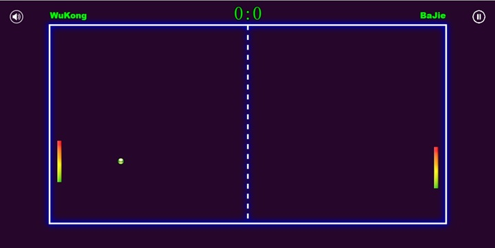
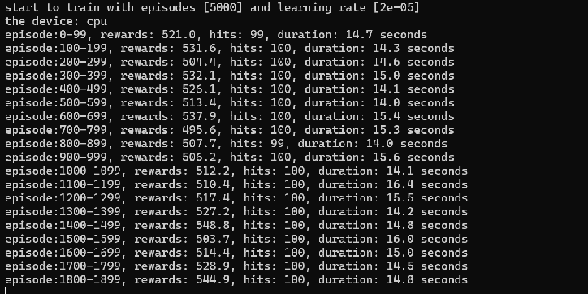

# The Pong game with Reinforcement Learning AI Agent



## Getting started

The reinforcement learning `Pong` game demo written in javascript, which runs in web browser.

## Description

Two AI agents play the game. You only can be act as an audience.

If you are a programmer:
1. install VSCode and `Live Server` extension
2. open the `index.html` file with `Live Server` extension

If you are not a programmer:
deploy the project as an app in any one HTTP server

## Actions

Pong has the action space of 2 with the table below listing the meaning of each action's meanings

| Value     | Meaning   |
| --------- | --------- |
| 0         | move up   |
| 1         | move down |

## States

Pong's state is a tuple with 5 items. the table below lists the meaning of each item meanings

| index     | Meaning               | min value | max value |
| --------- | --------------------- | --------- | --------- |
| 0         | the ball x coordinate |  0.0      | 1.0       |
| 1         | the ball y coordinate |  0.0      | 1.0       |
| 2         | the ball x velocity   |  0.5      | 0.1       |
| 3         | the ball y velocity   | -0.2      | 0.2       |
| 4         | the paddle y position |  0.0      | 1.0       |

the x positive direction is to the right
the y positive direction is to the up

## Rewards

You get the reward score when the ball pass the paddle or collide with the paddle.

```
reward = math.log(abs(paddle_pos - ball_position.y) / area_height + 0.000001)
```
 - `paddle_pos` is the paddle center y position
 - `ball_position.y` is the ball center y position
 - `area_height` is the game area height

## How to train the model

Please refer to the training [`README.md`](./docs/README.md)for training details. [How to train](./docs/README.md)

## Screen Shots

1. the training screen shot


2. the game screen shot
